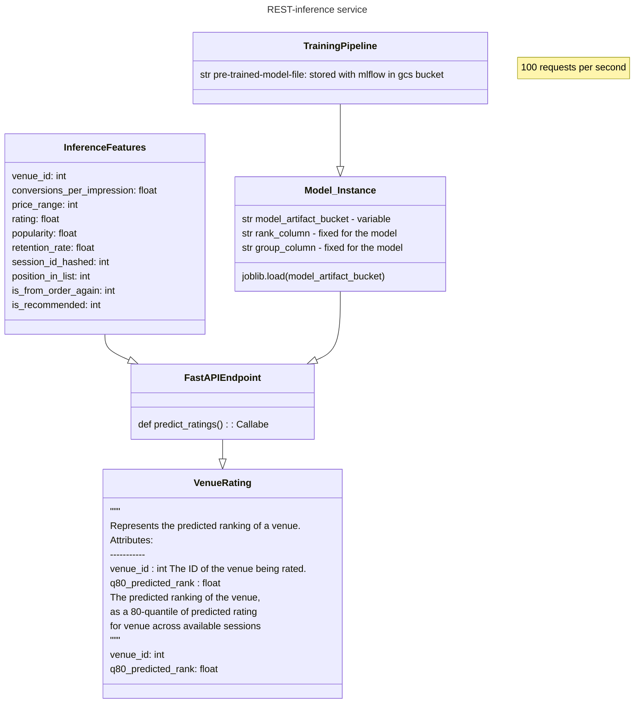

personalization
_________________
An end-to-end demo machine learning pipeline to provide an artifact for a real-time inference service
# Aim
We want to create a machine learning training code which satisfies the following properties that given
data can train the model and save it to artifact
# Solution
Our implementation of the package 'personalization'
We choose to use Polars to read data, it is roughly 2-3 times faster than Pandas and supports nice API for 
aggregations and features creation.
For the model part, we decided to take lightGBM  due to ts speed, small size (model artifact size up to 50 Mb on 300 million rows of search data) and explainability. The user should choose lightGBM parameters carefully.
We tested an example lightgbm params in notebooks/train.ipynb.
# Offline evaluation
The offline evaluation has been done in notebooks/train.ipynb, we can see significant increase in NDCG levels across venues with our model against the baseline.
# CICD: code style and PyPI
The code is checked with pre-commit configs, tested and published in Github Actions, current coverage is around 80 percent.

The inference service code can be found here https://github.com/ra312/model-server
# How to run

1. obtain sessions.csv and venues.csv and move them to the root folder
2. Check python --verrsion > 3.8.1 
3. Install personalization
```console
    python -m pip instal personalization
```
1. Train pipeline and get artifact,
 
   please run the following command in shell
```console
python3 -m personalization \
    --sessions-bucket-path sessions.csv \
    --venues-bucket-path venues.csv \
    --objective lambdarank \
    --num_leaves 100 \
    --min_sum_hessian_in_leaf 10 \
    --metric ndcg --ndcg_eval_at 10 20 \
    --learning_rate 0.8 \
    --force_row_wise True \
    --num_iterations 10 \
    --trained-model-path trained_model.joblib
```

# TODO
For demo purposes, we choose to ingest sessiona and venues data locally and save model file locally. Given more time and infrastructure, I would add more things

1. Scalability: add Flyte workflow (reusing the code here)
2. Data: add support to ingest sessions and venues data from a database
3. Versioning: add MLFlow integration

[](http://badge.fury.io/py/personalization)
[](https://github.com/ra312/personalization/actions?query=workflow%3ATest)
[](https://github.com/ra312/personalization/actions?query=workflow%3ALint)
[](https://codecov.io/gh/ra312/personalization)
[](https://gitter.im/ra312/personalization?utm_source=badge&utm_medium=badge&utm_campaign=pr-badge&utm_content=badge)
[](https://pypi.python.org/pypi/personalization/)
[](https://pepy.tech/project/personalization)
[](https://github.com/psf/black)
[](https://timothycrosley.github.io/isort/)
[](https://github.com/ra312/personalization/actions/workflows/action.yml)
_________________

[Read Latest Documentation](https://ra312.github.io/personalization/) - [Browse GitHub Code Repository](https://github.com/ra312/personalization/)
_________________
=======
# model server


[](https://pypi.python.org/pypi/model-server/)

[](https://pypi.python.org/pypi/model-server/)

[](https://pypi.python.org/pypi/model-server/)

[](https://github.com/woltapp/wolt-python-package-cookiecutter)


---

**Documentation**: [https://ra312.github.io/model-server](https://ra312.github.io/model-server)
**Training Source Code**: [https://github.com/ra312/personalization](https://github.com/ra312/personalization)
**Source Code**: [https://github.com/ra312/model-server](https://github.com/ra312/model-server)
**PyPI**: [https://pypi.org/project/model-server/](https://pypi.org/project/model-server/)

---

A model server  for almost realtime inference

## Installation

```sh
pip install model-server
```

## Development

* Clone this repository
* Requirements:
  * [Poetry](https://python-poetry.org/)
  * Python 3.8.1+
* Create a virtual environment and install the dependencies

```sh
poetry install
```

* Activate the virtual environment

```sh
poetry shell
```

### Testing

```sh
pytest
```

### Documentation

The documentation is automatically generated from the content of the [docs directory](./docs) and from the docstrings
 of the public signatures of the source code. The documentation is updated and published as a [Github project page
 ](https://pages.github.com/) automatically as part each release.

### Releasing

Trigger the [Draft release workflow](https://github.com/ra312/model-server/actions/workflows/draft_release.yml)
(press _Run workflow_). This will update the changelog & version and create a GitHub release which is in _Draft_ state.

Find the draft release from the
[GitHub releases](https://github.com/ra312/model-server/releases) and publish it. When
 a release is published, it'll trigger [release](https://github.com/ra312/model-server/blob/master/.github/workflows/release.yml) workflow which creates PyPI
 release and deploys updated documentation.

### Pre-commit

Pre-commit hooks run all the auto-formatters (e.g. `black`, `isort`), linters (e.g. `mypy`, `flake8`), and other quality
 checks to make sure the changeset is in good shape before a commit/push happens.

You can install the hooks with (runs for each commit):

```sh
pre-commit install
```

Or if you want them to run only for each push:

```sh
pre-commit install -t pre-push
```

Or if you want e.g. want to run all checks manually for all files:

```sh
pre-commit run --all-files
```

---

This project was generated using the [wolt-python-package-cookiecutter](https://github.com/woltapp/wolt-python-package-cookiecutter) template.
